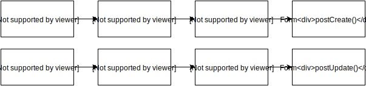

# Form / DynamicObject


Module which handle forms.


## Table of Contents

[TOC]


## Installation

*command:*
```
$ composer require wame/DynamicObject:0.0.1
```

or

*composer.json:*
```NEON
{
    // ...
    "require": {
        // ...
        "wame/DynamicObject" : "0.0.1"
    }
}
```


## Usage

### Forms

To obtaining form component, module provide builders. Each builder provide functionality to handle different tasks.

#### Create

*config:*
```NEON
Admin.MyFormBuilder:
    class: Wame\DynamicObject\Forms\EntityFormBuilder
    setup:
        - setRepository(@EventRepository)
        - add(@Wame\DynamicObject\Forms\Groups\IBasicGroupFactory, 'BasicGroup', {priority: 200})
        - add(@Wame\DynamicObject\Forms\Containers\ITitleContainerFactory, 'TitleContainer', {priority: 190})
```

*php:*
```PHP
/**
 * Create component form
 * 
 * @return EntityForm   form
 */
protected function createComponentForm() 
{
    return $this->context->getService("Admin.MyFormBuilder")
            ->setEntity($this->entity)
            ->build($this->domain);
}
```

#### Methods

**add(containerFactory, containerName, containerParameters)**

*example:*
```
- add(@Wame\DynamicObject\Forms\Containers\ITitleContainerFactory, 'TitleContainer', {priority: 90})
```

*Parameters:*
* priority - containers with higher priority are top
* domain - value that must be equals with value provided in `build` method

**remove(containerName)**

*example:*
```
- remove('TitleContainer')
```

#### Config

*example:*
```NEON
services:
    MyFormBuilder:
        class: Wame\MyModule\Forms\MyFormBuilder
        setup:
            - add(@Wame\DynamicObject\Forms\Containers\ITitleContainerFactory, 'TitleContainer', {priority: 90})
```


#### BaseFormBuilder

Builder which doesn't save anything to database, there is nothing like `create`/`update` ... just `submit`.

*Builder:*
```PHP
class FilterFormBuilder extends BaseFormBuilder
{
    /** {@inheritDoc} */
    public function submit($form, $values)
    {
        // code
    }
    
}
```

*Component:*
```PHP
protected function createComponentSortForm()
{
    $form = $this->articleFormBuilder->build();

    return $form;
}
```

#### EntityFormBuilder

Improved builder that handle single entity. Edit provide entity which is used for container's default values and create empty entity, which is filled by containers.

Builder must implement `getRepository` method, that is used to working with entity.

In order to handle default values, you need call `setEntity`.

#### LangEntityFormBuilder

Builder working with translatable data.

In order to handle default values, you need call `setEntity` and `setLangEntity`.

*MyFormBuilder.php (FormBuilder)*
```PHP
<?php

namespace Wame\MyModule\Forms;

use Wame\MyModule\Repositories\MyRepository;
use Wame\DynamicObject\Forms\LangEntityFormBuilder;

class MyFormBuilder extends LangEntityFormBuilder
{
	/** @var ParameterRepository */
	private $parameterRepository;
	
	
	public function __construct(ParameterRepository $parameterRepository)
    {
        parent::__construct();
        
		$this->parameterRepository = $parameterRepository;
	}
    
    
    /** {@inheritDoc} */
    public function getRepository()
    {
        return $this->myRepository;
    }
	
}
```

### Form event callbacks flow



### Containers

Every form container shoud be in this structure: `forms\conintainers\<containerName>\<ContainerName>Container` (e.g.: `forms\containers\title\TitleContainer`), to achieve consistence .

*ITitleContainerFactory (Container)*
```PHP
<?php

namespace Wame\DynamicObject\Forms\Containers;

use Wame\DynamicObject\Registers\Types\IBaseContainer;

interface ITitleContainerFactory extends IBaseContainer
{
	/** @return TitleContainer */
	public function create();
}

class TitleContainer extends BaseContainer
{
    /** {@inheritDoc} */
    public function configure() 
	{
		$this->addText('title', _('Title'))
				->setRequired(_('Please enter title'));
    }

    /** {@inheritDoc} */
	public function setDefaultValues($entity, $langEntity = null)
	{
        $this['title']->setDefaultValue($entity->getTitle());
	}

    /** {@inheritDoc} */
    public function create($form, $values)
    {
        $entity = method_exists($form, 'getLangEntity') ? $form->getLangEntity(): $form->getEntity();
        $entity->setTitle($values['title']);
    }

    /** {@inheritDoc} */
    public function update($form, $values)
    {
        $entity = method_exists($form, 'getLangEntity') ? $form->getLangEntity(): $form->getEntity();
        $entity->setTitle($values['title']);
    }

}
```

#### Methods

##### configure

Configure container

*example:*
```PHP
/** {@inheritDoc} */
public function configure() 
{
    $this->addText('title', _('Title'))
            ->setRequired(_('Please enter title'));
}
```

##### compose($template)
Bind data to the template

*example:*
```PHP
/** {@inheritDoc} */
public function compose($template) 
{
    $template->count = $this->count;
}
```

##### create($form, $values)
Create event callback

##### update($form, $values)
Update event callback

##### postCreate($form, $values)
Post create event callback

##### postUpdate($form, $values)
Post update event callback

#### Name

To prevent collision of `name` parameter, containers has format: `name="[<ContainerName>][<InputName>]"` (e.g.: `name="[TitleContainer][title]"`)

#### Templates

Forms can be rendered automatically or by `TemplateFormRender`, which render containers using latte templates.

Templates are located in same folder as container. Default name is `default.latte`.

*example:*
```HTML
{var $title = $_form['TitleContainer']['title']}
<div class="form-group">
    {label $title/}
    <input class="form-control" n:name="$title">
</div>
```

#### Groups

It's possible create form group in container's method `configure`:

```PHP
/** {@inheritDoc} */
public function configure() 
{
    $this->getForm()->addGroup(_('Short description'));
    // ...
}
```


## FAQ


## Contribute


## License
